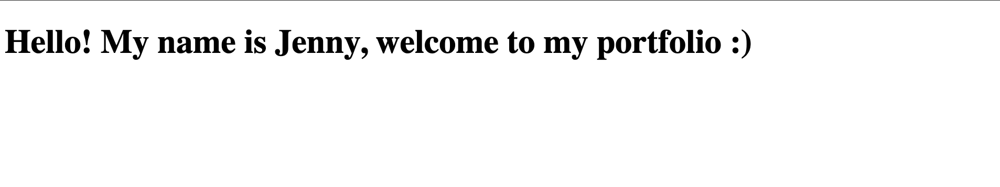

# Part 1: Creating `index.html`

1. Create a directory called `<GH Username>.github.io`
2. Create a new file called `index.html` under the new directory
3. Type the following snippet into `index.html`

```html
<!DOCTYPE html>
<html>
  <head>
    <meta charset="utf-8" />
    <title>My Portfolio</title>
  </head>
  <body>
    <h1>Hello! My name is [name] ✌️</h1>
  </body>
</html>
```

4. Now, we are going to see how our code looks on the browser. In your terminal, navigate to your `<GH Username>.github.io` directory, and type in `open index.html` - this will allow you to see your changes by automatically opening a tab on your browser for your html file.
1. Alternatively: open Chrome, and press `Ctrl + O` on Windows/Linux or `Cmd + O` on Mac to open the file explorer dialog box. Then, navigate to your `<GH Username>.github.io` directory and open the `index.html` file
1. You will see something like this on your browser
   <p align="center">
   
   </p>
1. When you make any changes to `index.html`, you can refresh the newly-opened tab to see your changes. Add the following into the `h1` tag:

```html
<h1>Hello! My name is [name] ✌️, welcome to my portfolio :)</h1>
```

7. When you refresh the page, you should see
   <p align="center">
   
   </p>
