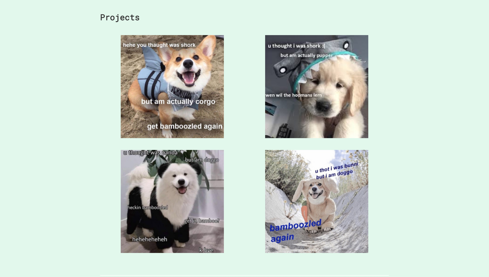

# 💼 What will we be building?

We will be building a static portfolio in HTML/CSS! You will come out of this mini-tutorial with something useful you can further enhance to use as your portfolio to recruiters and potential employers.

# 🌌 Getting started with your first portfolio
## The finished product

Your finished portfolio will look similar to this, with minor differences in content

#### Intro & About sections

  

#### Projects section

#### Contact section

  
  

## We have split the project into four parts

1. Creating `index.html`
2. Designing & building a wireframe
3. Adding CSS & implementing responsive web design
4. Adding advanced styling

#### Want to learn more? 
We recommend checking out the Mozilla Developer Network (MDN) [web docs](https://developer.mozilla.org/en-US/docs/Learn)!